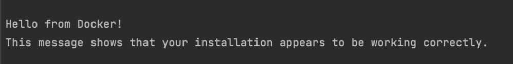
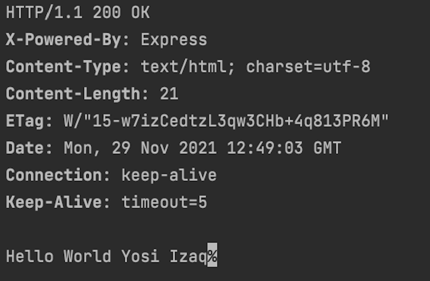

# Docker Workshop Challenge #

Welcome to the SAP's Docker Workshop Challenge!

## Challenge 1 ##
## 1.1
* First, we'll make sure Docker is available.
* Let's run the classic hello-world container!
* `$ docker run hello-world`

### END
* docker hello-world service runs correctly in the terminal

## 1.2
* Pull the latest nginx image
* Run the image in detach mode
* Verify that nginx is up and running and that the port is exposed correctly.

### END
To verify:
* check nginx homepage is available using the browser

## Challenge 2 ##
* Create a Dockerfile
* Add the Linux OS - Ubuntu 16.04 image
* Add your name as a label
* Create a directory /home/myapp in the container
* Set an environment variable *USER* with your name
* Run the container in attached mode

### END
* Connect to the container
* Verify that the directory was created
* Verify USER env variable contains you name!

 
## Challenge 3 ##
* Create a dockerized web server
* You may choose any language and framework
  * We recommend NodeJS/express, but any other language/framework is possible!
* The server should listen on port 8080 of the container and print to stdout when it’s up and listening
* You should map a private host port to the container port so that the server can be accessed from the outside
* You should create a directory for your application in the image and copy your source code to it
* Build and run the image

## END
* Verify the image exists.
* Print the container logs.
* Send an HTTP GET request to the server and verify you get back the right response
  * For example, “Hello world <my user name>!”

  
## Challenge 4 - *BONUS* ##
* Use docker compose to create a microservice based application
* One container will serve as a web server
* The second container will serve as the persistence (DB)
* The application should support the creation and retrieval of tasks for a task manager
* Add an endpoint for adding a task. Should use HTTP PUT 
* Add an endpoint for reading a task. Should use HTTP GET with a task id as path parameter 
* Add an endpoint for reading all tasks. Should use HTTP GET
